# Digital Library Management System

A modern Spring Boot application for managing a digital library. The system supports book management, user reservations, GitHub login authentication, and utilizes Redis caching for enhanced performance.

## 🔧 Technologies Used

* **Spring Boot 3**
* **Thymeleaf** (template engine)
* **Spring Security** with **OAuth2 GitHub login**
* **Spring Data JPA** with **MySQL**
* **Redis Cache**
* **Bootstrap 5** for UI styling

## 🌟 Features

* Login with GitHub (OAuth2)
* Role-based access: Admin / User
* Book CRUD operations (Admin only)
* View books with pagination and search (by title, author, or ISBN)
* Reserve books if copies are available (User only)
* Cancel reservations
* Dynamic book availability (copies increase/decrease with reservation status)
* Session-based access control

## 📁 Project Structure

```
src/
 └── main/
     ├── java/kadri/Digital/Library/Management/System/
     │   ├── controller/
     │   ├── entity/
     │   ├── repository/
     │   ├── service/
     │   ├── config/
     │   └── DigitalLibraryManagementSystemApplication.java
     └── resources/
         ├── templates/
         └── application.properties
```
## 📸 Screenshots

Here are some UI snapshots of the Digital Library Management System:

### 🏠 Home Page
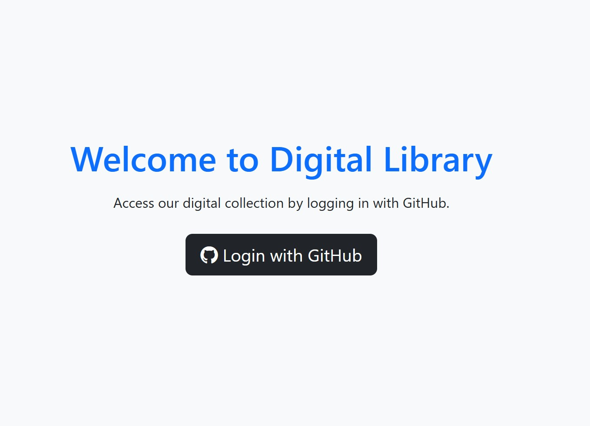

---

### 📚 Books List Page (User)
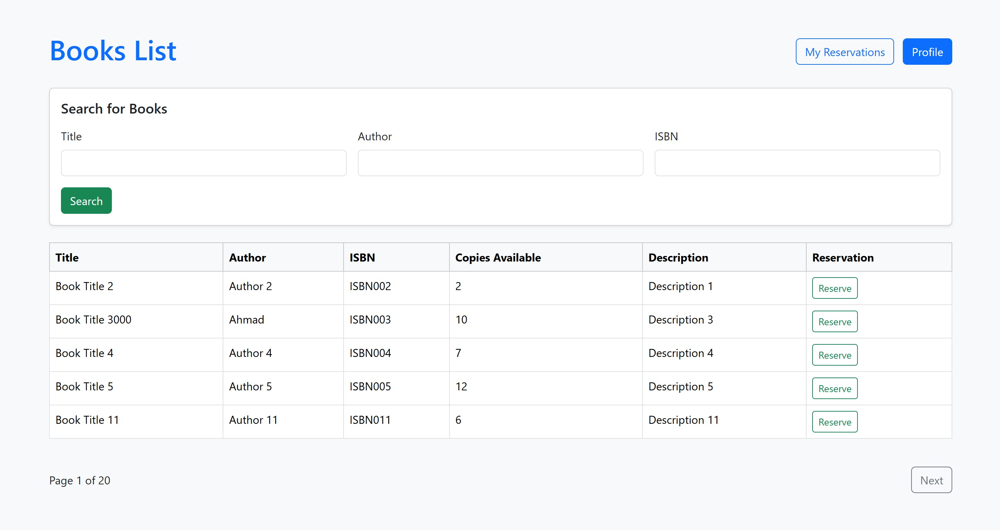

---

### 👤 Profile Page (OAuth GitHub Login)
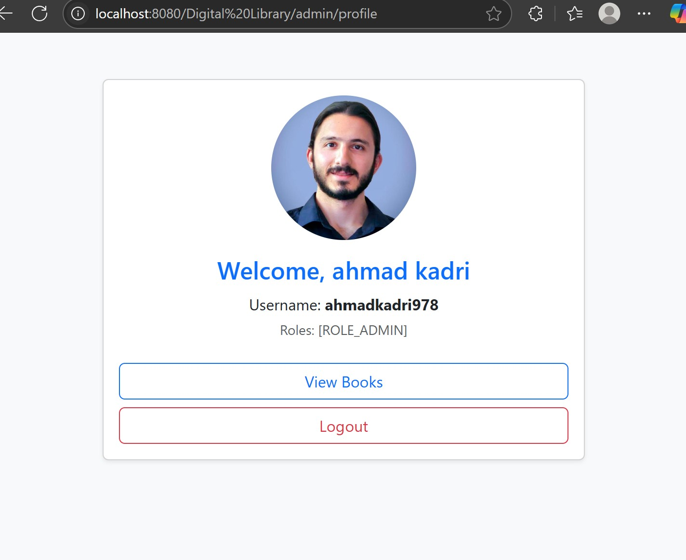

---

### 🔍 Search Books
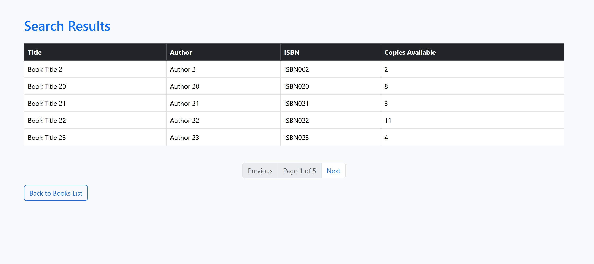

---

### 🧾 My Reservations (User)
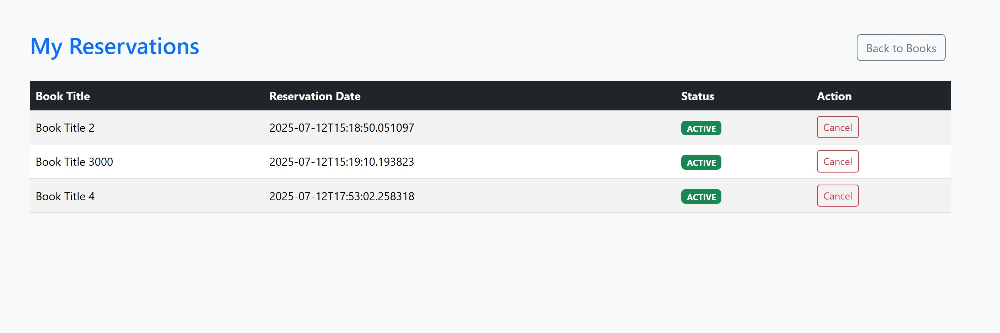

---

### 🧾 Duplicated Reservations 
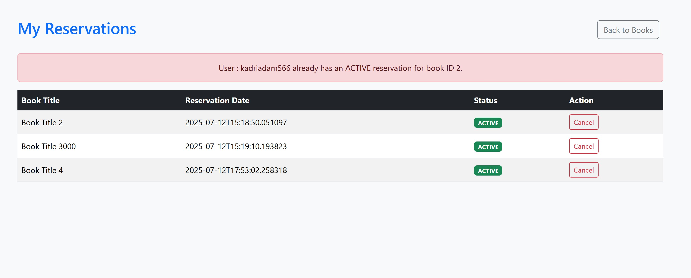

---

---
### 🧾 Reservations (Admin)
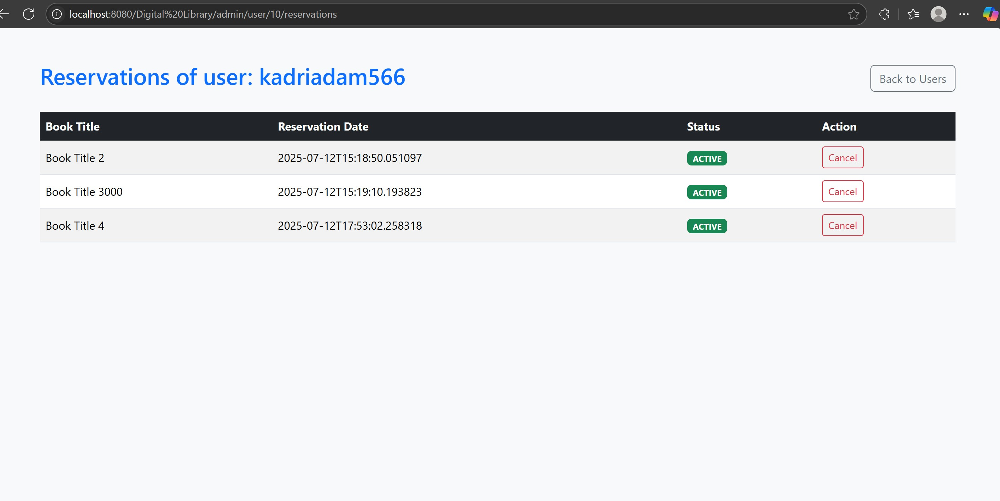

---

### 📊 Admin - View All Books
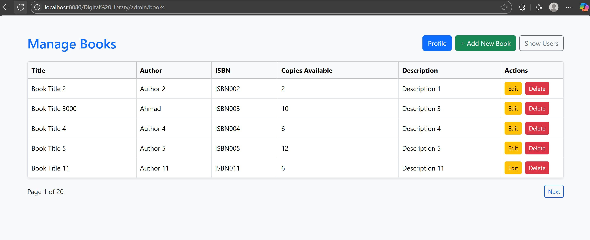

---

### ➕ Admin - Add Book
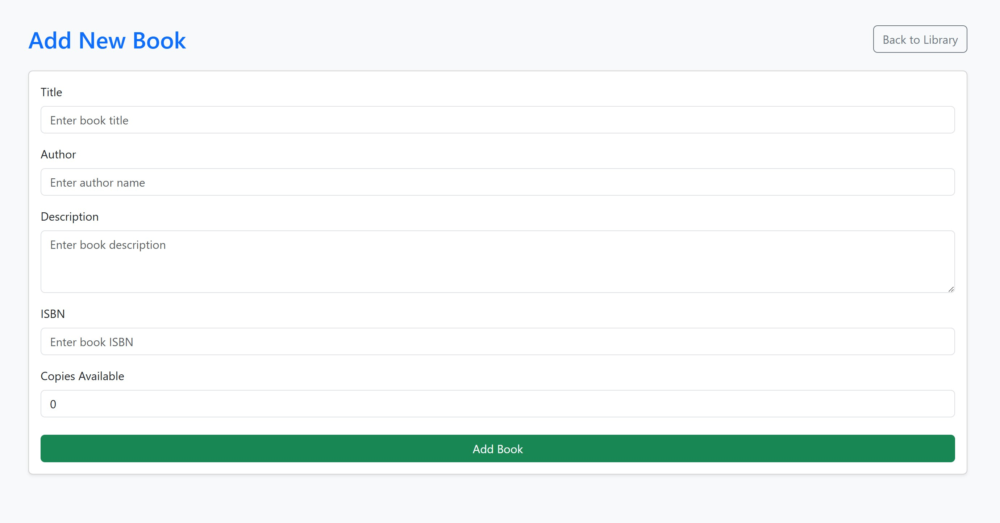

---

### 📝 Admin - Edit Book
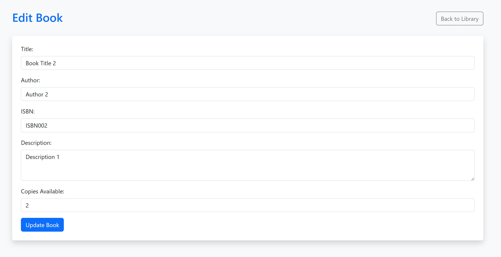

---

### 👥 Admin - Manage Users
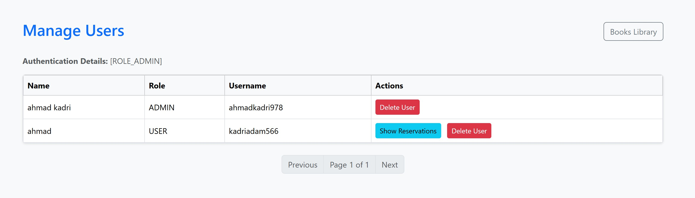

---

### 📋 Admin - Manage Reservations


## 🚀 Getting Started

### 1. Clone the repository

```bash
git clone https://github.com/ahmadkadri978/Digital-Library-Management-System.git
```

### 2. Set up your database

Create a MySQL database named `digital_library` and update credentials in `application.properties`.

### 3. Redis Setup (Optional but recommended)

Ensure Redis server is running locally on default port `6379`. The application uses Redis for caching.

### 4. Configure GitHub OAuth2

Register an app on GitHub Developer Settings and set your `client-id` and `client-secret` in `application.properties`.

> Alternatively, use the included `application-sample.properties` as a reference to create your own secure config file.

### 5. Run the application

```bash
mvn spring-boot:run
```

Access the app at: [http://localhost:8080](http://localhost:8080)


## 🧠 Notes

* All cache-related services are annotated with `@Cacheable` and `@CacheEvict`
* Role-based visibility and access are handled using Spring Security
* All user data is managed based on GitHub OAuth profile

---

🔗 [Visit my portfolio](https://ahmadkadri978.github.io/portfolio)
